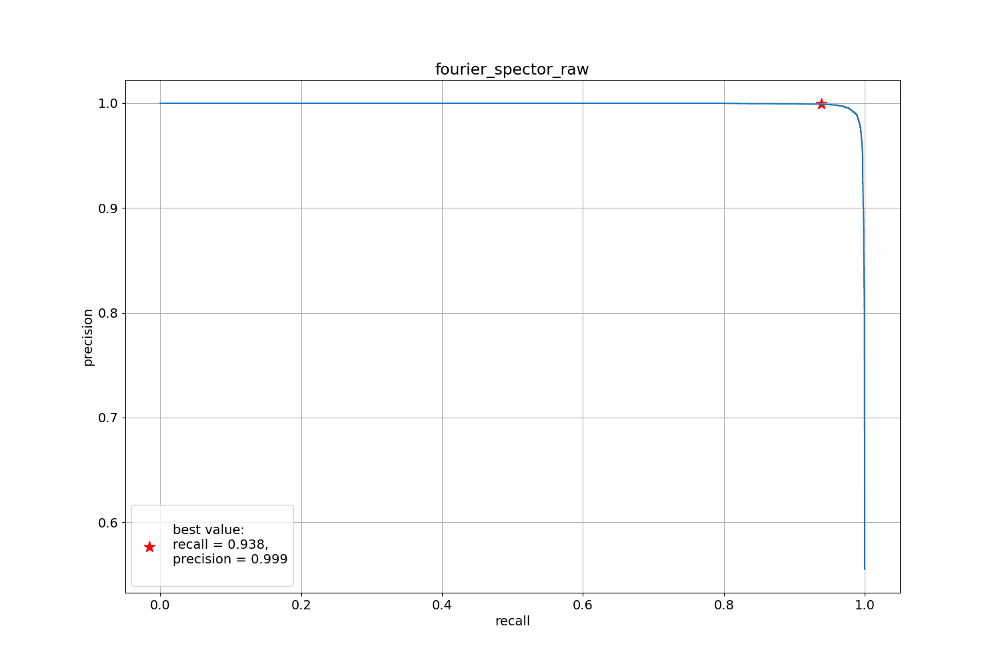
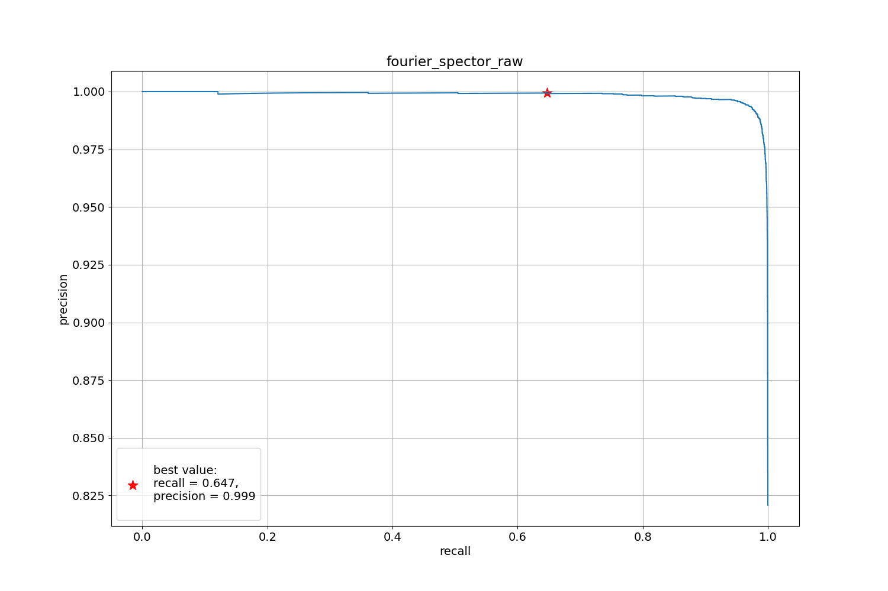

# [EEG data binary spleep stage classification](https://github.com/Tarelkinal/eeg-classification/blob/main/docs/EEG_classification_task_descr.pdf)
## How to run
Dag of train pipeline is implemented with `Makefile`.
git
Config managment is implemented with `hydra`.
1. Clone project and move to project dir
   ```bash
   git clone <REPO_LINK>
   cd eeg-classification
   ```
2. Load data [SleepDataset](https://mega.nz/folder/WbAXUCZD#iRr7rcXJZ3pMPemVd4JUQw) and put unzipped files in *data/raw*
3. To run full pipeline:
    * install requirements
    * clear datasets, build features
    * search hyperparams with `optuna` and `hydra  --multirun`
    * train best model and make prediction on test dataset
    * render report
    
    use
    ```bash
    make all
    ```
4. To run only data part pipeline use
    ```bash
   make data_pipe  
   ```
5. To run only model train part pipeline use
    ```bash
   make model_pipe
    ```
6. Change config files in *conf* to change pipeline parameters

Project Organization
------------

    ├── Makefile           <- Makefile with dag of train pipeline.
    ├── README.md          <- Project description.
    ├── docs               <- Task description.
    ├── data
    │   ├── prep           <- Path to store preprocessed datasets reade to use in trainig.
    │   └── raw            <- Path to store raw input data.
    │
    ├── README.md          <- How to use.
    ├── models             <- Trained and serialized models.
    ├── outputs            <- Path to store hydra run logs, appear after first run.
    ├── notebooks
    │   ├── 2.1-baseline-fft.ipynb  <- baseline-2: lgbmClassifier on fourier transformed eeg data
    │   ├── 2.0-baseline.ipynd      <- baseline-1: lgbmClassifier on flatten eeg data
    │   └── 1.0-EDA.ipynb           <- Exploratory data analisis
    │
    ├── reports     <- Training reports with metrics obtained and figures.
    ├── conf        <- Path to store hydra configs.
    ├── src                
    │   ├── data   
    │   │   ├── prep_features.py            <- data preprocessing pipeline
    │   │   └── feature_transformer.py      <- data transformers implementations
    │   │
    │   ├── utils
    │   │   ├── report_writer.py    <- functions to deal with report
    │   │   └── data.py             <- dataclass to store preprocessed data implementation
    │   │
    │   └──  models                     
    │       │                               
    │       ├── predict_model.py    <- trian model with best hyperparams and make predict
    │       └── train_model.py      <- find best models hyperparams based on valid set estimation
    │
    └── tests   <- Unit tests

--------

## Solution
1. Filter extra labels and provide label encoding with [DataTransformer](https://github.com/Tarelkinal/eeg-classification/blob/main/src/data/feature_transformer.py)
2. Train valid split based on `person_id` with [TrainValidSplitByColumnTransformer](https://github.com/Tarelkinal/eeg-classification/blob/main/src/data/feature_transformer.py)
3. Build fourier spector on raw EEG data, build statistics feature (mean, std, min, max, quantiles) in Delta, Theta 
   and Alpha spectrum bands with [FFTransformer](https://github.com/Tarelkinal/eeg-classification/blob/main/src/data/feature_transformer.py)
4. Train `LGMBClassifier` with `EarlyStopping` on valid set
5. Search hyperparams with `hydra optuna` plugin
6. Make prediction and metrics calculation


## Results

<table>

<TR>
   <TD class="c2">experiment name</TD>
   <TD class="c3">num features</TD>
   <TD class="c3">num train objects</TD>
   <TD class="c3">num estimators</TD>
   <TD class="c3">ROC AUC</TD>
   <TD class="c4">precision ss4</TD>
   <TD class="c5">recall ss4</TD>
   <TD class="c6">precision ssW</TD>
   <TD class="c7"><SPAN>recall ssW</SPAN></TD>
</TR>

<TR>
   <TD class="c2">EEG raw features</TD>
   <TD class="c3">1000</TD>
   <TD class="c3">205356</TD>
   <TD class="c3">570</TD>
   <TD class="c3">0.98952</TD>
   <TD class="c4">0.96826</TD>
   <TD class="c5">0.92166</TD>
   <TD class="c6">0.99952</TD>
   <TD class="c7"><SPAN>0.55756</SPAN></TD>
</TR>

<TR>
   <TD class="c2">EEG raw features; small dataset</TD>
   <TD class="c3">1000</TD>
   <TD class="c3">83676</TD>
   <TD class="c3">284</TD>
   <TD class="c3">0.98419</TD>
   <TD class="c4">0.94835</TD>
   <TD class="c5">0.92154</TD>
   <TD class="c6">0.99686</TD>
   <TD class="c7"><SPAN>0.55128</SPAN></TD>
</TR>

<TR>
   <TD class="c2">Fourier spector raw</TD>
   <TD class="c3">200</TD>
   <TD class="c3">205356</TD>
   <TD class="c3">214</TD>
   <TD class="c3">0.99885</TD>
   <TD class="c4">0.99922</TD>
   <TD class="c5">0.93799</TD>
   <TD class="c6">0.99938</TD>
   <TD class="c7"><SPAN>0.6469</SPAN></TD>
</TR>

<TR>
   <TD class="c2">Fourier spector raw; small dataset</TD>
   <TD class="c3">200</TD>
   <TD class="c3">83676</TD>
   <TD class="c3">106</TD>
   <TD class="c3">0.99819</TD>
   <TD class="c4">0.99908</TD>
   <TD class="c5">0.92325</TD>
   <TD class="c6">0.99954</TD>
   <TD class="c7"><SPAN>0.57666</SPAN></TD>
</TR>

<TR>
   <TD class="c2">Fourier spector statistics</TD>
   <TD class="c3">42</TD>
   <TD class="c3">205356</TD>
   <TD class="c3">10</TD>
   <TD class="c3">0.95467</TD>
   <TD class="c4">0.91585</TD>
   <TD class="c5">0.92154</TD>
   <TD class="c6">0.9382</TD>
   <TD class="c7"><SPAN>0.83333</SPAN></TD>
</TR>

<TR>
   <TD class="c2">Fourier spector statistics; small dataset</TD>
   <TD class="c3">42</TD>
   <TD class="c3">83676</TD>
   <TD class="c3">64</TD>
   <TD class="c3">0.96276</TD>
   <TD class="c4">0.85498</TD>
   <TD class="c5">0.92154</TD>
   <TD class="c6">0.98064</TD>
   <TD class="c7"><SPAN>0.52083</SPAN></TD>
</TR>

</table>

* **small dataset**: deleted all person without Sleep stage 4
* **precision-recall evaluation**: get max precision with recall not worse than baseline recall

### Conclusions
* Using raw Fourier spector gets the best pr-metrics, which do not degrade on a small dataset
* The use of raw data also gives a good result, but loses in the complexity of the model: a large depth of boosting is required   
* Using statistics of Fourier spector bands gets the simplest model 

### Best PR plots (Full dataset - Fourier spector raw features)

#### Sleep stage 4 PR-curve   


#### Sleep stage W PR-curve


## TO DO NEXT
Find optimal dataset size:
   * discover dependency metrics on dataset size

Use Deep Learning to:
   * extract features from raw EEG data
   * extract features from Fourier spectrum
   * union features in model architecture (tho-handed network, concat...)
   * taking into account the time order in the person context
   * use negative selection to obtain hard object with 'Sleep stage W' label
   * unsupervised pretrain model to get EEG data embedding
      * predict next sequence element
      * predict masked sequence element

## links
1. https://habr.com/ru/post/479164/
2. https://physionet.org/content/sleep-edfx/1.0.0/

