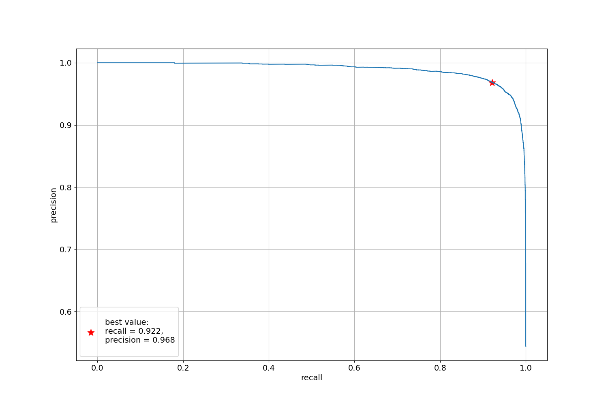
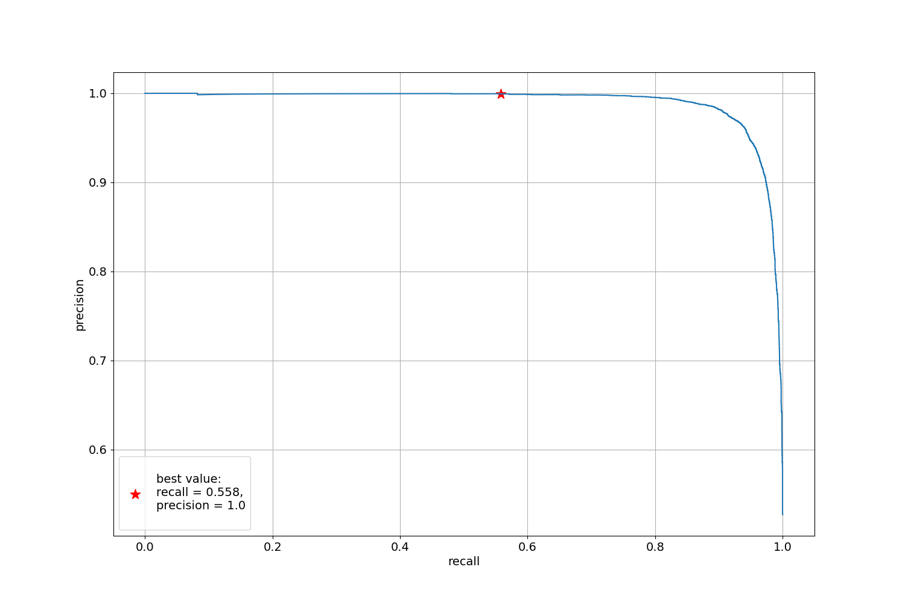

# EEG data binary spleep stage classification
## How to ran
Dag of train pipeline is implemented with `Makefile`.

Config managment is implemented with `hydra`.
1. Clone project and move to project dir
   ```bash
   git clone <REPO_LINK>
   cd eeg-classification
   ```
2. Load data [SleepDataset](https://mega.nz/folder/WbAXUCZD#iRr7rcXJZ3pMPemVd4JUQw) and put unzipped files in *data/raw*
3. To run full pipeline:
    * install requirements
    * clear datasets, build features
    * search hyperparams with `optuna` and `hydra  --multirun`
    * train best model and make prediction on test dataset
    * render report
    
    use
    ```bash
    make all
    ```
4. To run only data part pipeline use
    ```bash
   make data_pipe  
   ```
5. To run only model train part pipeline use
    ```bash
   make model_pipe
    ```
6. Change config files in *conf* to change pipeline parameters

Project Organization
------------

    ├── Makefile           <- Makefile with dag of train pipeline.
    ├── README.md          <- Project description.
    ├── data
    │   ├── prep           <- Path to store preprocessed datasets reade to use in trainig
    │   └── raw            <- Path to store raw input data
    │
    ├── README.md          <- How to use.
    ├── models             <- Trained and serialized models.
    ├── outputs            <- Path to store hydra run logs, appear after first run
    ├── notebooks
    │   ├── 2.1-baseline-fft.ipynb  <- baseline-2: lgbmClassifier on fourier transformed eeg data
    │   ├── 2.0-baseline.ipynd      <- baseline-1: lgbmClassifier on flatten eeg data
    │   └── 1.0-EDA.ipynb           <- Exploratory data analisis
    │
    ├── reports     <- Training reports with metrics obtained and figures.
    ├── conf        <- Path to store hydra configs
    ├── src                
    │   ├── data   
    │   │   ├── prep_features.py            <- data preprocessing pipeline
    │   │   └── feature_transformer.py      <- data transformers implementations
    │   │
    │   ├── utils
    │   │   ├── report_writer.py    <- functions to deal with report
    │   │   └── data.py             <- dataclass to store preprocessed data implementation
    │   │
    │   └──  models                     
    │       │                               
    │       ├── predict_model.py    <- trian model with best hyperparams and make predict
    │       └── train_model.py      <- find best models hyperparams based on valid set estimation
    │
    └── tests   <- unit tests

--------
1. https://habr.com/ru/post/479164/

## Solution
1. Filter extra labels and provide label encoding with [DataTransformer](https:/github.com/Tarelkinal/eeg-classification/src/data/feature_transform.py)
2. Train valid split based on `person_id` with [TrainValidSplitByColumnTransformer](https:/github.com/Tarelkinal/eeg-classification/src/data/feature_transform.py)
3. Build fourier transform on raw EEG data, build statistics feature (mean, std, min, max, quantiles) in Delta, Theta 
   and Alpha spectrum bands with [FFTransformer](https:/github.com/Tarelkinal/eeg-classification/src/data/feature_transform.py)
4. Train `LGMBClassifier` with `EarlyStopping` on valid set
5. Search hyperparams with `hydra optuna` plugin
6. Make prediction and metrics calculation

## Results
### ROC_AUC
|dataset  |roc_auc |
--- | ---|
|train roc auc||
|valid roc auc||
|test roc auc||

### Presicion-Recall
|label |precision  | recall|
--- | --- | ---|
|sleep stage 4|0.70905|0.9403|
|sleep stage W|0.8984|0.57626|

#### Sleep stage 4 PR-curve   


#### Sleep stage W PR-curve


## TO DO NEXT
Use Deep Learning to:
   * extract features from raw EEG data
   * extract features from Fourier spectrum
   * somehow union features in model architecture (tho-handed network, concat...)
   * taking into account the time order in the person context
   * use negative selection to obtain hard object with 'Sleep stage W' label
   * unsupervised pretrain model to get EEG data embedding
      * predict next sequence element
      * predict masked sequence element

## links
1. https://habr.com/ru/post/479164/
2. https://physionet.org/content/sleep-edfx/1.0.0/

